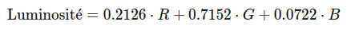
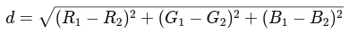
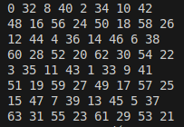

# Ditherpunk - Application console

TODO : Description

## Installation

TODO 

## Développeurs

- Quentin BOURREAU
- Marin TREMINE

## Fonctionnalités

TODO

## Utilisation

ditherpunk [OPTIONS] <INPUT> <OUTPUT> <SUBCOMMAND>

ditherpunk.exe -- --help
```bash
Convertit une image en monochrome ou vers une palette réduite de couleurs.

Positional Arguments:
  input             le fichier d’entrée
  output            le fichier de sortie (optionnel)

Options:
  --help, help      display usage information

Commands:
  seuil             Rendu de l’image par seuillage monochrome.  
  palette           Rendu de l’image avec une palette contenant un nombre limité de couleurs
```
Exemple 
    
```bash
cargo run -- input.png seuil
```

```bash
cargo run -- input_image.png output_image.png palette --n-couleurs 4
```


### Question 2 : Ouvrir une image depuis un fichier

Pour ouvrir une image depuis un fichier, nous avons utilisé la méthode suivante :

```rust
use image::io::Reader as ImageReader;
use image::DynamicImage;

let img = ImageReader::open("image.png")?.decode()?;
```

DynamicImage

Le type DynamicImage est une énumération de la crate image qui peut représenter différentes formes d'images. Il peut contenir des images en niveaux de gris, en RGB, en RGBA, etc. Cela permet de manipuler des images sans se soucier de leur format interne initial.

Convertir en RGB8

Pour convertir une DynamicImage en une image en mode RGB8, nous avons utilisé la méthode to_rgb8() :

```rust
let rgb_image = img.to_rgb8();
```

### Question 3 : Sauvegarder une image

Nous avons choisi de créer un fichier utils.rs qui centralise toutes les fonctions utilitaires nécessaires à la manipulation et à la transformation des images, ce qui permet de rendre le code plus modulaire et réutilisable, en séparant clairement les différentes opérations logiques. Cela améliore également la lisibilité pour les réponses aux différentes questions par la suite.

Pour sauver l'image obtenue au format PNG, nous avons utilisé la méthode save :

```rust
rgb_image.save("output.png")?;
```

Ainsi, nous avons créé la fonction :

```rust
/// Sauvegarder une image RGB8 dans un fichier au format PNG
pub fn sauvegarder_image_rgb8(image_rgb8: &RgbImage, path_out: &str) {
    match image_rgb8.save(path_out) {
        Ok(_) => println!("Image sauvegardée avec succès à l'emplacement : {}", path_out),
        Err(err) => {
            eprintln!("Erreur lors de la sauvegarde de l'image : {}", err);
            std::process::exit(1); // Quitte le programme avec un code d'erreur
        }
    }
}

utils::sauvegarder_image_rgb8(&image_rgb8, &path_out); // Question 3
```

Si l'image d'entrée contient un canal alpha (mode RGBA), la conversion en RGB8 supprime ce canal. La transparence est perdue, et les zones transparentes deviennent opaques, affichant leur couleur RGB. L'image sauvegardée au format PNG est entièrement opaque, car le type RgbImage ne prend pas en charge la transparence. Cela signifie que toute information de transparence sera perdue dans l'image convertie. Ainsi, si l'on souhaite garder le canal alpha, il faudrait garder l'image sans conversion en RGB8.

### Question 4 : Affichage de la couleur du pixel (32,52)

Pour afficher la couleur d'un pixel, nous utilisons simplement la fonction **get_pixel** accessible à partir de l'image au format RGB8. Nous avons donc créé cette fonction générique prennant l'image et les coordonnées du pixel que l'on souhaite récupérer la couleur : 

```rust
/// Récupérer un pixel à partir de ses coordonnées
pub fn recuperer_pixel(image_rgb8: &RgbImage, x: u32, y: u32) -> Rgb<u8> {
    // Vérifie si les coordonnées sont valides
    if x < image_rgb8.width() && y < image_rgb8.height() {
        *image_rgb8.get_pixel(x, y)
    } 
    else {
        eprintln!("Erreur de récupération du pixel car les coordonnées sont hors des limites de l'image");
        std::process::exit(1); // Quitte le programme avec un code d'erreur
    }
}

let pixel = utils::recuperer_pixel(&image_rgb8, 32, 52); // Question 4
println!("La couleur du pixel (32, 52) est : {:?}", pixel);
```

### Question 5 : Pixels alternés en blanc

Nous avons implémenté la fonction **transformer_pixels_un_sur_deux** qui remplace un pixel sur deux par du blanc (RGB = [255, 255, 255]). L'image obtenue reste globalement reconnaissable, mais son apparence est fortement altérée, surtout pour les images avec beaucoup de détails :

```rust
/// Passer un pixel sur deux en blanc dans une image RGB8
pub fn transformer_pixels_un_sur_deux(image_rgb8: &mut RgbImage) {
    for (x, y, pixel) in image_rgb8.enumerate_pixels_mut() {
        if (x + y) % 2 == 0 {
            *pixel = Rgb([255, 255, 255]); // pixel en blanc
        }
    }
}

utils::transformer_pixels_un_sur_deux(&mut image_rgb8); // Question 5
```

### Question 6 : Récupérer la luminosité d’un pixel

Pour trouver le calcul, nous avons été sur google pour trouver le calcul de la luminosité d'un pixel. Nous avons implémenté la fonction **luminosite_pixel** qui calcule la luminosité perçue d'un pixel en utilisant une pondération des composantes RGB basée sur leur contribution relative à la perception humaine :

Voici notre formule utilisée : 

```rust
/// Récupérer la luminosité d’un pixel
pub fn luminosite_pixel(pixel: &Rgb<u8>) -> f32 {
    0.2126 * pixel[0] as f32 + 0.7152 * pixel[1] as f32 + 0.0722 * pixel[2] as f32
}
```

### Question 7 : Implémenter le traitement

On parcourt chaque pixel et on regarde si sa luminosité est supérieure à 50% (128.0), on le remplace par du blanc; inférieure, on le remplace par du noir. Nous avons donc créé la fonction suivante :

```rust
// Fonction de seuillage monochrome
pub fn monochrome_par_seuillage(image_rgb8: &mut RgbImage) {
    // Parcourir tous les pixels de l'image
    for (_x, _y, pixel) in image_rgb8.enumerate_pixels_mut() {
        // Calculer la luminosité du pixel
        let luminosite = luminosite_pixel(pixel);
        
        // Si la luminosité est supérieure à 128 (seuillage à 50%), mettre en blanc, sinon en noir
        if luminosite > 128.0 {
            *pixel = Rgb([255, 255, 255]);
        }
        else {
            *pixel = Rgb([0, 0, 0]);
        }
    }
}
```

### Question 8 : Permettre à l’utilisateurice de remplacer “noir” et “blanc” par une paire de couleurs au choix.

Cette fonctionnalité permet à l'utilisateur ou l'utilisatrice de personnaliser les couleurs utilisées dans le processus de seuillage monochrome. Par défaut, les couleurs sont définies comme "noir" et "blanc" si l'utilisateur ne saisit aucune option de couleur. Cependant, l'utilisateur·rice peut désormais spécifier une paire de couleurs personnalisées via les options en ligne de commande suivant les couleurs prédéfinis dans la palette : 

**[NOIR, BLANC, ROUGE, VERT, BLEU, JAUNE, CYAN, MAGENTA]**

Nous avons géré les erreurs :
- Dans le cas où l'utilisateur ne passe aucune couleur, cela passe les couleurs par défaut noir (couleur 1) et blanc (couleur 2).
- Dans le cas où l'utilisateur passe la couleur 1 mais pas la couleur 2, cela va prendre la couleur 1 et la couleur 2 va être celle par défaut (soit noir).
- Dans le cas où l'utilisateur passe la couleur 2 mais pas la couleur 1, cela va prendre la couleur 2 et la couleur 1 va être celle par défaut (soit blanc).
- Dans le cas où l'utilisateur passe une couleur n'existant pas parmi la palette, cela retourne une erreur.

Dans un premier temps, nous avons modifié le struct **OptsSeuil** pour inclure 2 options de personnalisation dans les arguments : 
- couleur_1: La première couleur personnalisée (optionnelle).
- couleur_2: La deuxième couleur personnalisée (optionnelle).

```rust
#[derive(Debug, Clone, PartialEq, FromArgs)]
#[argh(subcommand, name="seuil")]
/// Rendu de l’image par seuillage monochrome.
struct OptsSeuil {
    /// la couleur 1 personnalisée (optionnelle)
    #[argh(option)]
    couleur_1: Option<String>,

    /// la couleur 2 personnalisée (optionnelle)
    #[argh(option)]
    couleur_2: Option<String>,
}
```

Ensuite, nous avons créé une fonction **creer_liste_couleurs** pour créer la liste de couleurs qui génère une liste fixe de couleurs principales associées à leur nom. Chaque couleur est définie à l'aide d'une chaîne de caractères (le nom de la couleur) et d'une valeur RGB correspondante (triplet [R, G, B]). Nous avons choisi de pas faire en sorte que l'utilisateur saisissse directement les couleurs en hexadécimal et utiliser par la suite un convertisseur en RGB pour simplifier l'utilisation pour l'utilisateur et car le mode palette allait avoir besoin de ces couleurs par la suite.

```rust
/// Créer une liste avec des couleurs principales
pub fn creer_liste_couleurs() -> Vec<(&'static str, Rgb<u8>)> {
    vec![
        ("noir", Rgb([0, 0, 0])),
        ("blanc", Rgb([255, 255, 255])),
        ("rouge", Rgb([255, 0, 0])),
        ("vert", Rgb([0, 255, 0])),
        ("bleu", Rgb([0, 0, 255])),
        ("jaune", Rgb([255, 255, 0])),
        ("magenta", Rgb([255, 0, 255])),
        ("cyan", Rgb([0, 255, 255])),
    ]
}
```

Nous avons créé aussi une fonction **obtenir_couleur_par_nom** qui permet de rechercher et d'obtenir la valeur RGB d'une couleur à partir de son nom. Elle parcourt une liste de couleurs prédéfinies et renvoie la valeur correspondante si le nom est trouvé. Si la couleur n'existe pas, la fonction affiche un message d'erreur et termine le programme avec un code d'échec.

```rust
/// Obtenir une couleur par son nom à partir de la liste
pub fn obtenir_couleur_par_nom(nom: &str, liste_couleurs: &Vec<(&'static str, Rgb<u8>)>) -> Rgb<u8> {
    for (nom_couleur, rgb) in liste_couleurs {
        if *nom_couleur == nom {
            return *rgb;
        }
    }
    eprintln!("Erreur : La couleur '{}' n'est pas disponible.", nom);
    std::process::exit(1); // Quitte le programme avec un code d'erreur
}
```

Puis, nous avons créé la fonction principale qui fait le traitement **monochrome_par_seuillage** et qui applique un seuillage monochrome à une image en fonction de la luminosité des pixels. Chaque pixel de l'image est remplacé par l'une des deux couleurs spécifiées en fonction de sa luminosité. Cette transformation crée une image binaire où chaque pixel est soit de la couleur couleur_1, soit de la couleur couleur_2.

```rust
// Fonction de seuillage monochrome
pub fn monochrome_par_seuillage(image_rgb8: &mut RgbImage, couleur_1: Rgb<u8>, couleur_2: Rgb<u8>) {
    // Parcourir tous les pixels de l'image
    for (_x, _y, pixel) in image_rgb8.enumerate_pixels_mut() {
        // Calculer la luminosité du pixel
        let luminosite = luminosite_pixel(pixel);
        
        // Si la luminosité est supérieure à 128 (seuillage à 50%), appliquer couleur_1, sinon couleur_2
        if luminosite > 128.0 {
            *pixel = couleur_1;
        }
        else {
            *pixel = couleur_2;
        }
    }
}
```

Enfin, dans main.rs, nous avons dû gérer suivant le mode d'entrée (Seuil ou Palette) gérer dans le mode **Seuil** la récupération des couleurs saisies par l'utilisateur et faire le traitement :

```rust
match &args.mode {
        Mode::Seuil(opts_seuil) => {
            let couleurs = utils::creer_liste_couleurs();
            let couleur_1_rgb = if let Some(couleur) = &opts_seuil.couleur_1 {
                utils::obtenir_couleur_par_nom(couleur, &couleurs)
            }
            else {
                utils::obtenir_couleur_par_nom("blanc", &couleurs) // valeur par défaut
            };
            println!("La couleur 1 est : {:?}", couleur_1_rgb);

            let couleur_2_rgb = if let Some(couleur) = &opts_seuil.couleur_2 {
                utils::obtenir_couleur_par_nom(couleur, &couleurs)
            }
            else {
                utils::obtenir_couleur_par_nom("noir", &couleurs) // valeur par défaut
            };
            println!("La couleur 2 est : {:?}", couleur_2_rgb);

            utils::monochrome_par_seuillage(&mut image_rgb8, couleur_1_rgb, couleur_2_rgb); // Question 8
        },
        Mode::Palette(opts_palette) => {
            println!("Mode palette avec {} couleurs", opts_palette.n_couleurs);
        }
}
```

### Question 9 : Calculer la distance entre deux couleurs

Pour mesurer la différence entre deux couleurs en représentation RGB, nous utilisons la distance euclidienne. Cette méthode permet de quantifier à quel point deux couleurs sont similaires ou différentes en les considérant comme des points dans un espace tridimensionnel (rouge, vert, bleu).

La distance euclidienne est une mesure courante pour calculer la différence entre deux points dans un espace à plusieurs dimensions. Dans le cas des couleurs RGB, chaque composante (rouge, vert, bleu) correspond à une dimension.

Notre formule utilisée est : 

- R1​,G1​,B1​ sont les composantes RGB de la première couleur.
- R2,G2,B2​ sont les composantes RGB de la deuxième couleur.
- d est la distance entre les deux couleurs.


### Question 10 : Implémenter le traitement

Pour implémenter le traitement, nous avons implémenté la fonction suivante utilisant la formule :

```rust
/// Calculer la distance euclidienne entre deux couleurs RGB
pub fn distance_couleurs(couleur1: &Rgb<u8>, couleur2: &Rgb<u8>) -> f32 {
    let r_diff = couleur1[0] as f32 - couleur2[0] as f32;
    let g_diff = couleur1[1] as f32 - couleur2[1] as f32;
    let b_diff = couleur1[2] as f32 - couleur2[2] as f32;

    (r_diff.powi(2) + g_diff.powi(2) + b_diff.powi(2)).sqrt()
}
```

Ensuite, nous avons fait la fonction **monochrome_par_palette** qui transforme une image en une version monochrome basée sur une palette de couleurs donnée.

```rust
// Fonction de palette monochrome
pub fn monochrome_par_palette(image_rgb8: &mut RgbImage, couleurs_palette: Vec<Rgb<u8>>) {
    // Parcourir tous les pixels de l'image
    for (_x, _y, pixel) in image_rgb8.enumerate_pixels_mut() {
        let mut distance_min = std::f32::MAX;
        let mut couleur_plus_proche = *pixel;
        for couleur in &couleurs_palette {
            let distance = distance_couleurs(pixel, couleur);
            if distance < distance_min {
                distance_min = distance;
                couleur_plus_proche = *couleur;
            }
        }
        // Appliquer la couleur la plus proche au pixel correspondant dans l'image monochrome
        *pixel = couleur_plus_proche;
    }
}
```

Puis, nous gérons l'entrée de l'utilisateur sur le nombre de couleurs à utiliser dans main.rs. La fonction **creer_liste_couleurs** génère une liste de couleurs. Nous contruisons ensuite une palette avec n_couleurs (saisi par l'utilisateur) couleurs suivant la palette d'origine. Puis, nous appliquons le mode monochrome avec la palette :

```rust
let couleurs = utils::creer_liste_couleurs();
let mut couleurs_palette = vec![];
for i in 0..opts_palette.n_couleurs {
    couleurs_palette.push(couleurs[i].1);
}
println!("Les couleurs de la palette sont : {:?}", couleurs_palette);

utils::monochrome_par_palette(&mut image_rgb8, couleurs_palette); // Question 9
```

### Question 11 : Cas d'une palette vide ou palette trop importante

Si l'on passe une palette vide (l'option n_couleurs = 0), nous avons choisi de renvoyer l'image classique car nous ne voulions pas renvoyer une erreur à l'utilisateur car ce n'en est pas réellement une.

Néanmoins, pour le cas où l'utilisateur a saisi un nombre de couleurs trop important par rapport à la taille de la palette (soit supérieur à 8 actuellement mais on pourrait modifier la taille de la palette), nous avons décidé de renvoyer une erreur à l'utilisateur :

```rust
let couleurs = utils::creer_liste_couleurs();

if opts_palette.n_couleurs > couleurs.len() {
    eprintln!(
        "Erreur : Le nombre de couleurs demandé ({}) dépasse le nombre total de couleurs disponibles ({}).",
        opts_palette.n_couleurs,
        couleurs.len()
    );
    std::process::exit(1);
}
```

### Question 12 : Implémenter le tramage aléatoire des images

Nous avons commencé par créer une fonction **tramage_aleatoire** qui applique un tramage aléatoire (ou "random dithering") sur une image au format RgbImage. Elle transforme chaque pixel en noir ou blanc en fonction de sa luminosité et d'un seuil aléatoire.

```rust
/// Appliquer un tramage aléatoire sur une image RGB8
pub fn tramage_aleatoire(image_rgb8: &mut RgbImage) {
    for (_x, _y, pixel) in image_rgb8.enumerate_pixels_mut() {
        let luminosite = luminosite_pixel(pixel);
        let seuil: f32 = rand::thread_rng().gen();
        if luminosite / 255.0 > seuil {
            *pixel = Rgb([255, 255, 255]);
        }
        else {
            *pixel = Rgb([0, 0, 0]);
        }
    }
}
```

Ensuite au niveau du main.rs, nous avons dû gérer le nouveau mode Dithering. Nous avons donc ajouté un mode Dithering pour permettre le rendu d'images en utilisant différentes techniques de tramage. Ce mode offre une flexibilité supplémentaire en permettant de choisir parmi des méthodes de tramage (actuellement que aléatoire mais nous prévoyons les questions d'après).

```rust
#[derive(Debug, Clone, PartialEq, FromArgs)]
#[argh(subcommand)]
enum Mode {
    Seuil(OptsSeuil),
    Palette(OptsPalette),
    Dithering(OptsDithering), // ajouté
}
```

Nous avons ensuite défini des options pour ce dithering avec le choix d'une méthode de tramage à l'aide de l'option --tramage. La méthode choisie est spécifiée par un nouvel enum Methode que nous avons créé. Nous avons ajouté également implémenter **FromStr** pour **Methode** ce qui permet à l'utilisateur de spécifier une méthode de dithering sous forme de texte (via la ligne de commande ou du code), et d’obtenir la valeur correspondante de l’énumération Methode.

```rust
#[derive(Debug, Clone, PartialEq)]
pub enum Methode {
    Aleatoire,
}

// Implémentation de FromStr pour Enum
impl FromStr for Methode {
    type Err = String;

    fn from_str(s: &str) -> Result<Self, Self::Err> {
        match s.to_lowercase().as_str() {
            "aleatoire" => Ok(Methode::Aleatoire),
            _ => Err(format!("Méthode de dithering invalide: {}", s)),
        }
    }
}

#[derive(Debug, Clone, PartialEq, FromArgs)]
#[argh(subcommand, name = "dithering")]
/// Rendu de l'image par dithering.
pub struct OptsDithering {
    /// la méthode de tramage à utiliser
    #[argh(option)]
    tramage: Methode,
}
```

Puis, nous avons ensuite géré dans le nouveau mode dans la fonction principale pour appliquer le dithering aléatoire :

```rust
Mode::Dithering(_opts_dithering) => {
            println!("Mode dithering");
            match _opts_dithering.tramage {
                Methode::Aleatoire => {
                    println!("Méthode de dithering : Aleatoire");
                    utils::tramage_aleatoire(&mut image_rgb8); // Question 12
                },
            }
        }
```

### Question 13 : Déterminer 𝐵3

Grâce à notre fonction implémentée **generer_matrice_bayer** qui génère une matrice de Bayer d'ordre 2^order. Une matrice de Bayer est utilisée dans les algorithmes de tramage (dithering), notamment pour réduire la profondeur de couleur dans les images tout en minimisant les artefacts visuels. Puis, notre fonction **afficher_matrice** qui prend une matrice (un vecteur de vecteurs) en paramètre et affiche son contenu dans la console sous forme de grille.

```rust
/// Générer une matrice de Bayer de taille 2^order
pub fn generer_matrice_bayer(order: u32) -> Vec<Vec<u32>> {
    if order == 0 {
        return vec![vec![0]];
    }

    let matrice_precedente = generer_matrice_bayer(order - 1);
    let taille = matrice_precedente.len();
    let nouvelle_taille = taille * 2;
    let mut matrice = vec![vec![0; nouvelle_taille]; nouvelle_taille];

    for i in 0..taille {
        for j in 0..taille {
            let valeur_base = matrice_precedente[i][j] * 4;
            matrice[i][j] = valeur_base;
            matrice[i][j + taille] = valeur_base + 2;
            matrice[i + taille][j] = valeur_base + 3;
            matrice[i + taille][j + taille] = valeur_base + 1;
        }
    }

    matrice
}

/// Afficher une matrice d'entiers
pub fn afficher_matrice(matrice: &Vec<Vec<u32>>) {
    for ligne in matrice {
        for valeur in ligne {
            print!("{} ", valeur);
        }
        println!();
    }
}

let matrice = utils::generer_matrice_bayer(3);
utils::afficher_matrice(&matrice);
```

Ainsi, nous obtenons B3 = 

### Question 14 : Quel type de données utiliser pour représenter la matrice de Bayer? Comment créer une matrice de Bayer d’ordre arbitraire?

**Quel type de données utiliser pour représenter la matrice de Bayer?**

Nous avons représenté la matrice de Bayer par un vecteur de vecteurs (Vec<Vec<u32>>).

- Vec : Ce type est dynamique, ce qui permet nous de gérer des tailles arbitraires de matrice sans connaître à l'avance leur dimension.
- u32 : Les valeurs de la matrice sont des entiers non signés, ce qui est adapté pour notre traitement car les indices de la matrice de Bayer sont toujours positifs et croissants.

**Comment créer une matrice de Bayer d’ordre arbitraire?**

Comme montré précédemment, nous avons implémenté la méthode avec la fonction récursive **generer_matrice_bayer**.

- Cas de base (order == 0) :
    - Une matrice 1×1 contenant uniquement la valeur 0 est retournée.

- Récursion :
    - Si order > 0, la fonction appelle generer_matrice_bayer(order - 1) pour générer une matrice de l'ordre précédent.

    - Expansion de la matrice
        - À partir de la matrice précédente, nous contruisons une nouvelle matrice en la dupliquant et en appliquant les règles suivantes pour les 4 quadrants :
            - Quadrant supérieur gauche : valeurs multipliées par 4.
            - Quadrant supérieur droit : valeurs multipliées par 4 + 2.
            - Quadrant inférieur gauche : valeurs multipliées par 4 + 3.
            - Quadrant inférieur droit : valeurs multipliées par 4 + 1.

- Retour de la matrice complète
    - Une fois remplie, nous retournons la matrice.

### Question 15 : Implémenter le tramage par matrice de Bayer.

Pour implémenter le tramage par la matrice de Bayer, une fois avoir les fonctions de génération de la matrice de Bayer, il suffisait juste de créer une fonction **tramage_ordonne**. La fonction que nous avons implémentée applique donc un tramage ordonné sur une image en utilisant une matrice de Bayer.

```rust
/// Appliquer un tramage ordonné sur une image RGB8 en utilisant une matrice de Bayer
pub fn tramage_ordonne(image_rgb8: &mut RgbImage, matrice_bayer: &Vec<Vec<u32>>) {
    let taille = matrice_bayer.len();
    for (x, y, pixel) in image_rgb8.enumerate_pixels_mut() {
        let luminosite = luminosite_pixel(pixel);
        let i = x as usize % taille;
        let j = y as usize % taille;
        if luminosite / 255.0 > matrice_bayer[i][j] as f32 / (taille * taille) as f32 {
            *pixel = Rgb([255, 255, 255]);
        }
        else {
            *pixel = Rgb([0, 0, 0]);
        }
    }
}

let matrice = utils::generer_matrice_bayer(2);
utils::afficher_matrice(&matrice);
utils::tramage_ordonne(&mut image_rgb8, &matrice);
```

### Question 16 : Implémenter un mécanisme de diffusion d’erreur suivant la matrice donnée dans le sujet

a faire

### Question 17 : Pour une palette de couleurs, comment vous représentez l’erreur commise à chaque pixel, comment vous la diffusez

a faire

### Question 18 : Implémenter la diffusion d’erreur pour la palettisation d’images

a faire

### Question 19 : Implémenter la diffusion d’erreur pour la matrice de Floyd-Steinberg

a faire

### Question 20 : Comment représenter une matrice de diffusion d’erreur arbitraire? Permettre de changer de matrice de diffusion d’erreurs, et tester les matrices de diffusion de Jarvis-Judice-Ninke et Atkinson

a faire

### Question autres genre partie 7 à voir si faut écrire dans le README

a faire


<!-- ### Question 17 : expliquer dans votre README comment vous représentez l’erreur commise à chaque pixel, comment vous la diffusez pour une palette de couleurs.

Lorsque nous utilisons une palette de couleurs, l'erreur commise pour chaque pixel correspond à la différence entre la couleur réelle du pixel original et la couleur approximative choisie dans la palette. Cette erreur est un vecteur à trois composantes représentant les écarts dans les canaux rouge, vert et bleu.

Par exemple, si la couleur originale d'un pixel est (120, 200, 150) et que la couleur la plus proche dans la palette est (100, 180, 140), nous calculons l'erreur ainsi :

Erreur = Couleur originale - Couleur approximée = (120 - 100, 200 - 180, 150 - 140) = (20, 20, 10)

Après avoir calculé l'erreur pour un pixel, nous la diffusons à ses voisins pour compenser l'approximation. Cela permet de répartir les écarts cumulés sur l'ensemble de l'image, ce qui produit un rendu plus fluide.

Nous utilisons une matrice simple (donnée dans le sujet) pour diffuser l'erreur uniquement aux voisins qui n'ont pas encore été traités. Par exemple, la matrice suivante :

```rust
  *  0.5
  0.5  0
```

  - '*' représente le pixel en cours de traitement.
  - 0.5 indique qu'on envoie 50% de l'erreur au voisin immédiat de droite (x + 1, y).
  - 0.5 indique qu'on envoie 50% de l'erreur au voisin immédiat en bas (x, y + 1).

Supposons que le pixel (x, y) ait une erreur (20, 20, 10).

Selon la matrice, nous divisons cette erreur par les coefficients correspondants :
  - Pixel (x + 1, y) reçoit 50% de l'erreur : (10, 10, 5).
  - Pixel (x, y + 1) reçoit également 50% de l'erreur : (10, 10, 5).

Ces valeurs sont ajoutées aux pixels voisins avant qu'ils ne soient traités, pour ajuster leur couleur en conséquence. -->

